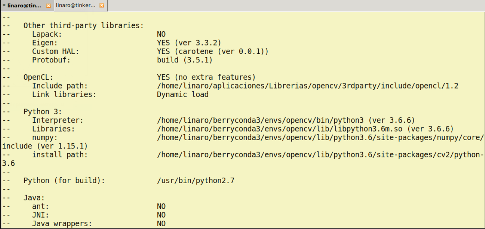
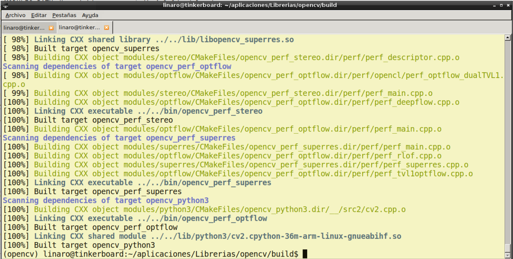
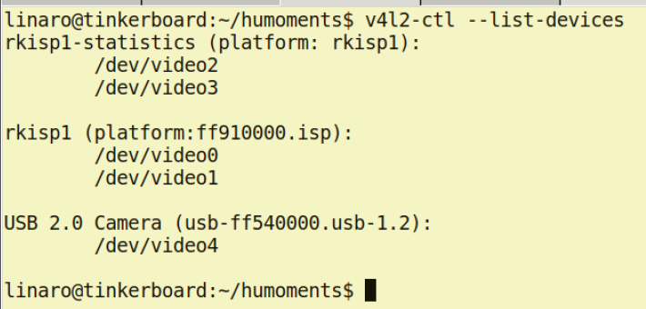
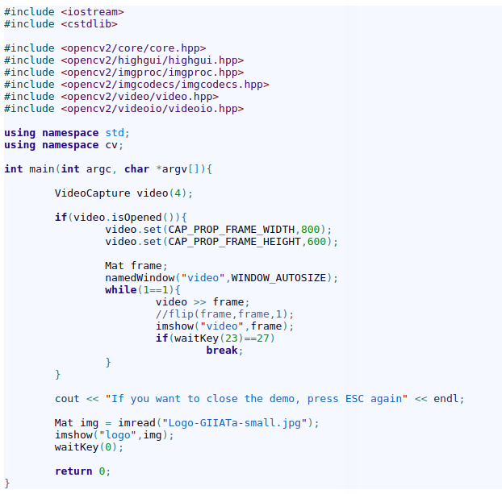
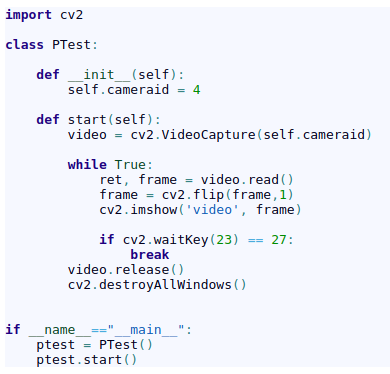

# Installing OpenCV 4.2.1 on Tinker Board

  

How to install OpenCV 4.2 with Python (Berryconda) and C++ Support
In this tutorial, we will provide some directions for installing [OpenCV 4.2](https://opencv.org/release/opencv-4-2-0/) (C++, Python 2.7 and Python 3.5 using [Berryconda](https://github.com/vlarobbyk/berryconda) on Tinker  Operating System on [Tinker Board](https://www.asus.com/us/Single-Board-Computer/Tinker-Board/). We will also provide a sample code that shows how to use the [ELP USB Camera Module] (https://www.amazon.com/ELP-Camera-megapixel-Fisheye-machine/dp/B01HD1V3UO).

## Step 1: Update OS packages
```
sudo apt -y update
sudo apt -y upgrade
```
## Step 2: Install OS required libraries
```
sudo apt-get -y remove x264 libx264-dev

--> Install dependencies

sudo apt-get -y install build-essential checkinstall cmake pkg-config yasm
sudo apt-get -y install git gfortran
sudo apt-get -y install libjpeg-dev
```
Install Lib Jasper

```
wget http://ftp.debian.org/debian/pool/main/j/jasper/libjasper-dev_1.900.1-debian1-2.4+deb8u3_armhf. deb

wget http://ftp.debian.org/debian/pool/main/j/jasper/libjasper1_1.900.1-debian1-2.4+deb8u3_armhf. deb

sudo apt-get install ./libjasper*.deb --install-recommends -y
```

Install codecs:

```
sudo apt-get -y install libtiff5-dev
 
sudo apt-get -y install libtiff-dev
 
sudo apt-get -y install libavcodec-dev libavformat-dev libswscale-dev libdc1394-22-dev
sudo apt-get -y install libxine2-dev libv4l-dev
cd /usr/include/linux
sudo ln -s -f ../libv4l1-videodev.h videodev.h

cd ~
```
Install QT, Protobuf and other libraries:
```
sudo apt-get install libgstreamer1.0-dev libgstreamer-plugins-base1.0-dev

sudo apt-get -y install libgtk2.0-dev libtbb-dev qt5-default
sudo apt-get -y install libatlas-base-dev
sudo apt-get -y install libmp3lame-dev libtheora-dev
sudo apt-get -y install libvorbis-dev libxvidcore-dev libx264-dev
sudo apt-get -y install libopencore-amrnb-dev libopencore-amrwb-dev
sudo apt-get -y install libavresample-dev
sudo apt-get -y install x264 v4l-utils

--> Optional dependencies
sudo apt-get -y install libprotobuf-dev protobuf-compiler
sudo apt-get -y install libgoogle-glog-dev libgflags-dev
sudo apt-get -y install libgphoto2-dev libeigen3-dev libhdf5-dev doxygen

```

## Step 3: Install Berryconda and create "opencv" virtual environment
In order to install **Berryconda** you must download the following version:

* [Berryconda3-2.0.0-Linux-armv7l.sh](https://github.com/jjhelmus/berryconda/releases/download/v2.0.0/Berryconda3-2.0.0-Linux-armv7l.sh)

After download process finishes, we must to execute the following commands:

```
chmod +x Berryconda3-2.0.0-Linux-armv7l.sh
./Berryconda3-2.0.0-Linux-armv7l.sh
```

Then we must create a virtual environment named "opencv":
```
conda create --name opencv python=3.6 numpy matplotlib
```

## Step 4: Download OpenCV and OpenCV-Contrib
```
git clone https://github.com/opencv/opencv.git
cd opencv
git checkout $cvVersion
cd ..
 
git clone https://github.com/opencv/opencv_contrib.git
cd opencv_contrib
git checkout $cvVersion
cd ..
```

## Step 5: Compile and install OpenCV with contrib modules
First, we must to create the build directory:
```
cd opencv
mkdir build
cd build
```
At this point, you have two options:

1. Creating a directory inside the OpenCV folder where the libraries will be installed. This option is useful because if you need to uninstall OpenCV,  only it is necessary for removing the folder.
2. Installing the libraries in system folders.

Following, you will find the details to accomplish the two options.

### Installing OpenCV in a custom directory
1. Create the "opencvi" installation directory
```
cd ..
mkdir opencvi
cd build
```

2. Activate the conda environment:
```
source activate opencv
```

3. Use the following instruction to compile OpenCV with conda support (just copy and paste these lines in console **paying attention to your local directory**):
```
cmake -D CMAKE_BUILD_TYPE=RELEASE \
    -D CMAKE_INSTALL_PREFIX=/home/linaro/aplicaciones/Librerias/opencv/opencvi \
    -D OPENCV_EXTRA_MODULES_PATH=/home/linaro/aplicaciones/Librerias/opencv_contrib/modules \
    -D ENABLE_NEON=ON \
    -D ENABLE_VFPV3=ON \
    -D BUILD_TESTS=OFF \
    -D BUILD_opencv_python2=OFF \
    -D BUILD_opencv_python3=ON \
    -D INSTALL_PYTHON_EXAMPLES=OFF \
    -D OPENCV_ENABLE_NONFREE=ON \
    -D CMAKE_SHARED_LINKER_FLAGS=-latomic \
    -D BUILD_EXAMPLES=OFF \
    -D PYTHON3_EXECUTABLE=$(which python3) \
    -D PYTHON3_INCLUDE_DIR=$(python3 -c "from distutils.sysconfig import get_python_inc; print(get_python_inc())") \
    -D PYTHON3_INCLUDE_DIR2=$(python3 -c "from os.path import dirname; from distutils.sysconfig import get_config_h_filename; print(dirname(get_config_h_filename()))") \
    -D PYTHON3_LIBRARY=$(python3 -c "from distutils.sysconfig import get_config_var;from os.path import dirname,join ; print(join(dirname(get_config_var('LIBPC')),get_config_var('LDLIBRARY')))") \
    -D PYTHON3_NUMPY_INCLUDE_DIRS=$(python3 -c "import numpy; print(numpy.get_include())") \
    -D PYTHON3_PACKAGES_PATH=$(python3 -c "from distutils.sysconfig import get_python_lib; print(get_python_lib())") ..
```
If the configuration process was successfully executed, you will se the following results (Figure 1):

*Figure 1. CMake options*
As can be seen, the Python-OpenCV libraries will be installed on our virtual environment.

4. Compile and install OpenCV with contrib modules
```
make -j2
make install
```

5. Add the installation path to the end of the **~/.bashrc**
```
nano ~/.bashrc
--> Add the following line to the end of the file:
export LD_LIBRARY_PATH=$LD_LIBRARY_PATH:/home/linaro/aplicaciones/Librerias/opencv/opencvi/lib/
```

6. Reload the .bashrc or open a new terminal
```
source ~/.bashrc
```

### Installing OpenCV in a OS directory
1. Execute the following code inside the "build" directory:
```
cmake -D CMAKE_BUILD_TYPE=RELEASE \
    -D CMAKE_INSTALL_PREFIX=/usr/local \
    -D OPENCV_EXTRA_MODULES_PATH=/home/linaro/aplicaciones/Librerias/opencv_contrib/modules \
    -D ENABLE_NEON=ON \
    -D ENABLE_VFPV3=ON \
    -D BUILD_TESTS=OFF \
    -D BUILD_opencv_python2=OFF \
    -D BUILD_opencv_python3=ON \
    -D INSTALL_PYTHON_EXAMPLES=OFF \
    -D OPENCV_ENABLE_NONFREE=ON \
    -D CMAKE_SHARED_LINKER_FLAGS=-latomic \
    -D BUILD_EXAMPLES=OFF \
    -D PYTHON3_EXECUTABLE=$(which python3) \
    -D PYTHON3_INCLUDE_DIR=$(python3 -c "from distutils.sysconfig import get_python_inc; print(get_python_inc())") \
    -D PYTHON3_INCLUDE_DIR2=$(python3 -c "from os.path import dirname; from distutils.sysconfig import get_config_h_filename; print(dirname(get_config_h_filename()))") \
    -D PYTHON3_LIBRARY=$(python3 -c "from distutils.sysconfig import get_config_var;from os.path import dirname,join ; print(join(dirname(get_config_var('LIBPC')),get_config_var('LDLIBRARY')))") \
    -D PYTHON3_NUMPY_INCLUDE_DIRS=$(python3 -c "import numpy; print(numpy.get_include())") \
    -D PYTHON3_PACKAGES_PATH=$(python3 -c "from distutils.sysconfig import get_python_lib; print(get_python_lib())") ..
```

2. Compile and install OpenCV with contrib modules
```
make -j2
sudo make install
```

If all goes well you will get the following results:


*Figure 2. Successful compilation*

## Determining the USB Camera number
If you use a USB Cam such as the [ELP USB Camera Module] (https://www.amazon.com/ELP-Camera-megapixel-Fisheye-machine/dp/B01HD1V3UO), you need to determine the number (id) that must be passed as a parameter to **VideoCapture()** constructor. This task can be easily done with the following command:
```
v4l2-ctl --list-devices
```
The command will provide the following result (Figure 3):

*Figure 3. v4l2-ctl command to determine where is attached the USB Camera*

As it can be seen, the camera is attached to dev4.

## Testing OpenCV in C++
With the following code we can test the camera (the code is available in the **cpp-test** folder):

*Figure 4. C++ Code to test the camera and image loading*

To compile the code you can use the following code (please **pay attention to your install dir**):
```
g++ TestCV.cpp -I/home/linaro/aplicaciones/Librerias/opencv/opencvi/include/opencv4 -L/home/linaro/aplicaciones/Librerias/opencv/opencvi/lib/ -lopencv_core -lopencv_highgui -lopencv_imgproc -lopencv_imgcodecs -lopencv_video -lopencv_videoio -o test.bin
```
To run the code simple execute:
```
./test.bin
```
## Testing OpenCV in Python
Firstly, we must activate the conda environment:
```
source activate opencv
```

After that we execute the following code we can test the camera (the code is available in the **python-test** folder):

*Figure 1. Code to test the camera and image loading in Python*